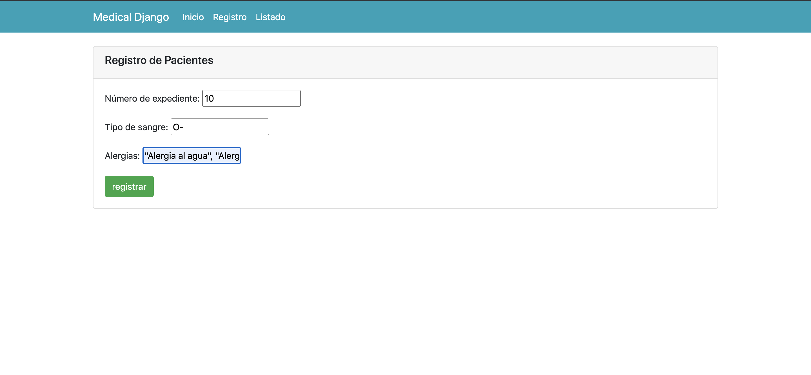

# Medical

### Patrones de diseño 

#### MVT (Modelo-Vista-Template)

* Modelo: Capa de acceso a la base de datos. Permite la estructuración de datos y relaciones.

* Vista: Lógica del negocio, interactua con el modelo para la manipulación de los datos. Y envia estos al template.

* Template: Capa presentación de datos e interación con el usuario desde el cliente.

#### API RESTFul

#### Tecnologías de desarrollo

Python v3.8.5

Django v3.0.5

psql (PostgreSQL) v12.3

#### Archivo DDL(.sql)

Se generaron dos archivo de lenguaje de definición de datos.

DDL Schema

```
   medical_schema.sql
```

DDL Tablas

```
    medical_tables.sql
```

Se pueden ejecutar estos archivos de dos maneras.

Terminal

### Nota

Se recomienda usar ON_ERROR_STOP=1 y -1, por lo que ejecuta el DDL en una sola transacción y aborta ante cualquier error.

```sh
   $ psql -v ON_ERROR_STOP=1 -1 -h <servidor.hostname> -f <script.sql> <basededatos>
```

Ejecutar contenido del archivo en una consola sql de cualquier cliente de SQL. ``` DBeaver, PgAdmin, etc. ```

#### Entornos virtuales

Es mejor usar ``` venv ``` herramienta Python para construir entornos virtuales localmente:

```sh 
   $ source <nombre-entorno>/bin/activate
```

#### Instalación de paquetes

``` sh
   pip install -r packages.txt
```

#### Configuración de conexión a base de datos

La configuración de la base de datos encuentra en:

```
./medical/settings/local.py
```

```
DATABASES = {
    'default': {
        'ENGINE': 'django.db.backends.postgresql_psycopg2',
        'NAME': 'pacientes', # os.path.join(BASE_DIR, 'db.sqlite3'),
        'USER': 'admin',
        'PASSWORD': 'admin',
        'HOST': '127.0.0.1',
        'PORT': '5432'
    }
}
```

#### Ejecutar proyecto

```sh
   python manage.py runserver
```

### Usuario y contraseña del administrador Django

##### Usuario: admin
##### Contraseña: admin

La creación y obtención de datos se puede realizar de dos formas diferentes.

## API REST

Endpoint para crear recurso.

##### [POST] /paciente/v1/records

Endpoint para recuper un recurso por id

##### [GET] /paciente/v1/records/:id

## MVT (Model-View-Template)

Creación de una interfaz CRUD utilizando vistas basadas en clases.

Registro



Listado

